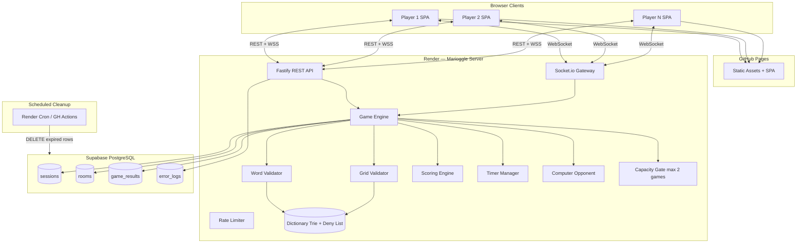
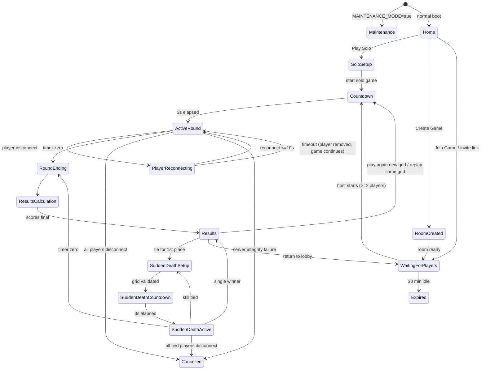

# Marioggle — Technical Specification

**Version:** 1.1  
**Status:** Approved — implementation in progress  
**Source of truth:** Marioggle Business Requirements Document (Approved for Technical Specification)  
**Repository:** https://github.com/taahirsayid/marioggle  
**Date:** 2026-07-05

---

## Table of Contents

1. [Executive Summary](#1-executive-summary)
2. [Recommended Technology Stack](#2-recommended-technology-stack)
3. [Architecture Overview](#3-architecture-overview)
4. [Data Model](#4-data-model)
5. [Session Model](#5-session-model)
6. [Game State Machine](#6-game-state-machine)
7. [Server-Authoritative Game Engine](#7-server-authoritative-game-engine)
8. [API and Real-Time Event Contracts](#8-api-and-real-time-event-contracts)
9. [Folder Structure](#9-folder-structure)
10. [Phased Implementation Plan](#10-phased-implementation-plan)
11. [Requirement Traceability Matrix](#11-requirement-traceability-matrix)
12. [Per-Requirement Implementation Detail](#12-per-requirement-implementation-detail)
13. [Technical Risks, Contradictions, Ambiguities and Free-Tier Limitations](#13-technical-risks-contradictions-ambiguities-and-free-tier-limitations)
14. [Decisions Requiring Business Approval](#14-decisions-requiring-business-approval)

---

## 1. Executive Summary

Marioggle is a browser-based, server-authoritative competitive word game (5×5 Boggle-style grid) supporting **solo vs computer** and **private multiplayer (2–6 players)**. The initial operating target is **2 concurrent active games** on **free-tier infrastructure**, with architecture choices that allow horizontal scaling later without a full rewrite.

**Core architectural principles (from BRD):**

- Server is authoritative for timer, scoring, word validation, grid identity, game state, and results.
- Clients are untrusted renderers and input collectors.
- Real-time multiplayer over WebSockets with REST for idempotent actions where appropriate.
- Active game state held in memory on the game server; durable metadata and results in PostgreSQL.
- No user accounts; guest sessions via HTTP-only secure cookie + server-side session record.

---

## 2. Recommended Technology Stack

| Layer | Choice | Rationale |
|-------|--------|-----------|
| **Frontend** | **React 19 + TypeScript + Vite** | Mature ecosystem, excellent touch/pointer event support for swipe and click, strong test tooling (Vitest, Testing Library, Playwright). SPA fits guest-only, no SSR requirement. |
| **Styling** | **CSS Modules + CSS custom properties** | Lightweight, no runtime cost, easy responsive layouts without heavy UI framework. Meets playful/colourful UI without over-engineering. |
| **Backend** | **Node.js 22 + TypeScript + Fastify** | Single language across stack; Fastify is fast and schema-driven. Handles HTTP + WebSocket upgrade cleanly. |
| **Real-time** | **Socket.io** (WebSocket with polling fallback) | Built-in rooms, reconnect, and heartbeat; simplifies BR-CONN requirements. Fallback helps Safari/mobile edge cases. |
| **Database** | **PostgreSQL via Supabase free tier** | Relational model for rooms, sessions, results; row-level TTL via scheduled jobs; 500 MB sufficient for initial scale. |
| **Cache / pub-sub (future scale)** | **Upstash Redis free tier** (optional Phase 1, required Phase 3+) | Not required for 2-game cap (in-memory suffices). Introduce when adding second server instance — avoids rewrite. |
| **Dictionary storage** | **SCOWL** (Spell Checker Oriented Word Lists) built into server-side Trie at deploy time | Free (LGPL-style licence with attribution). Covers Br/Aus/SA English at size 60+. WordNet rejected — SCOWL is purpose-built for word-list validation. |
| **Offensive filter** | **SCOWL category exclusions** + curated `offensive-deny-list.txt` | SCOWL excludes offensive categories by default at lower sizes; supplemental deny-list for display names and edge cases. |
| **Frontend hosting** | **GitHub Pages** via GitHub Actions (`taahirsayid/marioggle`) | Free, integrated with repo CI/CD; SPA base path `/marioggle/`. |
| **Backend hosting** | **Render free Web Service** (or Fly.io free) | Supports persistent WebSocket connections; single instance matches 2-game capacity target. |
| **Scheduled jobs** | **Render cron job** or **GitHub Actions scheduled workflow** hitting internal cleanup endpoints | 24 h result expiry, 20 d log expiry, stale room sweep. |
| **CI/CD** | **GitHub Actions** | Lint, unit/integration tests, E2E on PR; deploy on merge to main. |
| **E2E tests** | **Playwright** | Cross-browser (Chrome, Firefox, Safari/WebKit, Edge). |
| **Unit/integration tests** | **Vitest** | Shared with frontend; backend game engine tested in isolation. |
| **Logging** | **Structured JSON to stdout** → Render log drain; **no third-party APM** (out of scope, cost) | Meets BR-DATA-004 with retention job. |
| **Rate limiting** | **In-memory token bucket per IP/session** (server) | Sufficient at 2-game scale; Redis-backed when scaled. |

**Why not alternatives:**

- **Next.js SSR:** Unnecessary complexity for a game SPA; no SEO requirement for private rooms.
- **Firebase/Supabase Realtime:** Vendor lock-in for game logic; harder to enforce server-authoritative path validation.
- **Paid services (Pusher, Ably):** BR-NFR-004 requires free tier unless unavoidable — WebSocket on own server is sufficient at this scale.

---

## 3. Architecture Overview

### 3.1 Logical Architecture

```
┌─────────────────────────────────────────────────────────────────┐
│                     GitHub Pages (CDN)                           │
│  React SPA: Home, Solo Setup, Room Lobby, Game, Results, Help   │
└────────────────────────────┬────────────────────────────────────┘
                             │ HTTPS (REST) + WSS (Socket.io)
                             ▼
┌─────────────────────────────────────────────────────────────────┐
│              Render Web Service — Marioggle API                  │
│  ┌──────────────┐  ┌──────────────┐  ┌────────────────────────┐ │
│  │ REST Router  │  │ Socket.io    │  │ Game Engine (in-memory)│ │
│  │ sessions     │  │ gateway      │  │ rooms, rounds, timers  │ │
│  │ rooms        │  │              │  │ scoring, validation    │ │
│  │ results      │  │              │  │ grid gen, solo AI      │ │
│  │ maintenance  │  │              │  │ sudden death           │ │
│  └──────────────┘  └──────────────┘  └────────────────────────┘ │
│  ┌──────────────┐  ┌──────────────┐  ┌────────────────────────┐ │
│  │ Dictionary   │  │ Rate Limiter │  │ Capacity Gate (max 2)  │ │
│  │ Trie + deny  │  │              │  │ active games           │ │
│  └──────────────┘  └──────────────┘  └────────────────────────┘ │
└────────────────────────────┬────────────────────────────────────┘
                             │
                             ▼
┌─────────────────────────────────────────────────────────────────┐
│              Supabase PostgreSQL (free tier)                     │
│  sessions, rooms, players, game_results, error_logs              │
└─────────────────────────────────────────────────────────────────┘
```

### 3.2 Architecture Diagram (Mermaid)



### 3.3 Deployment Topology

| Environment | Frontend | Backend | Database |
|-------------|----------|---------|----------|
| Production | GitHub Pages (`main` branch Actions) | Render free Web Service (1 instance) | Supabase |
| Staging | GitHub Pages preview branch | Render staging service | Supabase branch DB or separate project |
| Local | Vite dev server | Fastify dev + local PostgreSQL (Docker) | Docker PostgreSQL |

### 3.4 Scaling Path (No Full Rewrite)

1. **Phase 1 (launch):** Single server instance, in-memory active games, PostgreSQL for durability.
2. **Phase 2:** Add Redis for session stickiness + pub/sub when moving to 2+ server instances.
3. **Phase 3:** Dedicated game-server process separate from API gateway; sticky sessions via load balancer.
4. **Phase 4:** Horizontal game shards; room routing by hash — game engine module unchanged.

The **game engine is a pure TypeScript module** with no direct I/O — this boundary enables scaling without rewrite.

---

## 4. Data Model

### 4.1 Entity Relationship Diagram (Mermaid)

```mermaid
erDiagram
    sessions ||--o{ room_players : "has"
    sessions ||--o{ game_participants : "has"
    rooms ||--|{ room_players : "contains"
    rooms ||--o| games : "hosts"
    games ||--|{ game_participants : "includes"
    games ||--o| game_results : "produces"
    games ||--o{ rounds : "contains"
    rounds ||--o{ word_submissions : "logs"

    sessions {
        uuid id PK
        string display_name
        timestamp created_at
        timestamp last_seen_at
        timestamp expires_at
        boolean is_active
    }

    rooms {
        uuid id PK
        string code UK "6-digit numeric"
        uuid host_session_id FK
        int max_players "2-6"
        int duration_seconds "60-180 step 10"
        enum status "waiting|active|expired|closed"
        timestamp last_activity_at
        timestamp expires_at
        string invite_token UK
    }

    room_players {
        uuid id PK
        uuid room_id FK
        uuid session_id FK
        string display_name
        int visual_id "1-6 colour/icon index"
        enum status "connected|disconnected|removed"
        boolean is_host
        timestamp joined_at
    }

    games {
        uuid id PK
        uuid room_id FK "nullable for solo"
        enum mode "solo|multiplayer"
        enum status "countdown|active|round_ending|results|sudden_death|cancelled"
        int duration_seconds
        jsonb grid "25 tiles server canonical"
        uuid grid_seed
        int active_round_number
        timestamp started_at
        timestamp ended_at
    }

    game_participants {
        uuid id PK
        uuid game_id FK
        uuid session_id FK
        string display_name
        int visual_id
        enum role "human|computer"
        enum difficulty "easy|medium|hard nullable"
        int score
        int valid_word_count
        enum connection_status "connected|reconnecting|disconnected|removed"
        timestamp disconnected_at
    }

    rounds {
        uuid id PK
        uuid game_id FK
        int round_number
        enum type "normal|sudden_death"
        jsonb grid
        jsonb solution_words "server-only, never sent to client until round end"
        timestamp countdown_start_at
        timestamp active_start_at
        timestamp active_end_at
    }

    word_submissions {
        uuid id PK
        uuid round_id FK
        uuid participant_id FK
        string word
        jsonb path "tile indices 0-24"
        enum outcome "accepted|duplicate|invalid|rejected_late|rejected_tampered"
        int points_delta
        string idempotency_key UK
        timestamp submitted_at
        timestamp server_received_at
    }

    game_results {
        uuid id PK
        uuid game_id FK
        jsonb rankings "ordered participant summaries"
        jsonb all_solution_words "for Show all possible words"
        timestamp accessible_until "created_at + 24h"
        timestamp created_at
    }

    result_access {
        uuid game_result_id FK
        uuid session_id FK
        PK "game_result_id, session_id"
    }

    error_logs {
        uuid id PK
        string level
        string message
        jsonb context
        timestamp created_at
        timestamp delete_after "created_at + 20d"
    }

    rate_limit_entries {
        string key PK "ip or session"
        string action
        int attempt_count
        timestamp window_start
        timestamp blocked_until
    }
```

### 4.2 In-Memory Game State (Active Games Only)

Each active game in `GameEngine` holds:

```typescript
interface ActiveGameState {
  gameId: string;
  mode: 'solo' | 'multiplayer';
  status: GameStatus;
  round: {
    number: number;
    type: 'normal' | 'sudden_death';
    grid: Tile[25];           // canonical grid
    solutionWords: SolutionWord[]; // full path+word list — NEVER sent to client during round
    countdownEndsAt: number;  // epoch ms, server clock
    activeEndsAt: number;
    durationMs: number;
  };
  participants: Map<sessionId, ParticipantRuntimeState>;
  hostSessionId: string;
  idempotencyCache: LRUMap<string, SubmitResult>; // BR-SCORE-003, BR-SEC-006
  timerHandle: NodeJS.Timeout;
  reconnectTimers: Map<sessionId, NodeJS.Timeout>; // 10 s windows
  tiedForFirst?: string[]; // sudden death eligibility
}
```

### 4.3 Grid Tile Model

```typescript
type Tile = {
  index: number;       // 0-24 row-major
  display: string;     // "A"-"Z" or "Qu"
  letterCount: number; // 1 or 2 for Qu
};
```

### 4.4 Data Retention

| Data | Retention | Mechanism |
|------|-----------|-----------|
| Game results | 24 hours | `accessible_until` column; cron deletes rows + `result_access` |
| Error logs | 20 days | `delete_after` column; cron DELETE |
| Inactive rooms | 30 minutes idle | `expires_at` reset on interaction; cron marks expired |
| Sessions | 24 hours sliding | cookie max-age; `last_seen_at` refresh |
| Active game in-memory | Duration of game | Cleared on end/cancel |
| IP addresses | **Not stored** | Rate limit uses in-memory IP with no persistence (BR-DATA-002) |

---

## 5. Session Model

### 5.1 Guest Session Flow

1. On first visit, server issues `marioggle_session` **HttpOnly, Secure, SameSite=Lax** cookie (UUID v4).
2. Session row created in PostgreSQL with optional `display_name` (set when entering solo/multiplayer flow).
3. WebSocket connection authenticated by passing short-lived **socket token** (JWT, 5 min TTL, signed with server secret) obtained via `POST /api/session/socket-token`.
4. **BR-PLAYER-003:** Each session may have at most one active WebSocket per game. New connection for same session in same game **replaces** the old socket (refresh scenario); second device gets `SESSION_SUPERSEDED` error.

### 5.2 Session ↔ Results Access (BR-RESULT-008)

- When a game completes, `result_access` rows are inserted for each participant's `session_id`.
- `GET /api/games/:gameId/results` verifies session cookie is in `result_access` and `accessible_until > now()`.
- No public URLs; invite links do not grant results access to non-participants.

### 5.3 Display Name Validation (BR-PLAYER-002)

- Server validates: length ≤ 10, unique within room (case-insensitive), not in offensive deny-list.
- Normalisation: trim whitespace, Unicode NFKC, reject control characters.

---

## 6. Game State Machine

### 6.1 Global Application States

| State | Description | Entry | Exit |
|-------|-------------|-------|------|
| `Maintenance` | App unavailable (BR-REL-006) | Env flag / admin toggle | Flag cleared |
| `Home` | Landing page | App load | User selects mode |
| `SoloSetup` | Difficulty + duration selection | Play Solo | Game created |
| `RoomCreated` | Host configuring room | Create Game | First joiner waiting |
| `WaitingForPlayers` | Lobby | Room created / return to lobby | Host starts |
| `Countdown` | 3 s pre-round (BR-TIME-004) | Start game / sudden death setup | Timer fires |
| `ActiveRound` | Gameplay | Countdown ends | Timer = 0 |
| `PlayerReconnecting` | Sub-state during ActiveRound | Disconnect detected | Reconnect or 10 s timeout |
| `RoundEnding` | Finalising submissions | Timer = 0 | Results computed |
| `ResultsCalculation` | Server computes rankings | RoundEnding | Results ready |
| `Results` | Results screen | Calculation done | Post-game action |
| `SuddenDeathSetup` | Tie detected, prepare SD round | Tie for 1st | New grid validated |
| `SuddenDeathCountdown` | 3 s countdown for SD | Grid ready | Timer fires |
| `SuddenDeathActive` | 60 s SD round (BR-TIE-002) | Countdown ends | Timer = 0 or winner |
| `Cancelled` | Game voided | All disconnect / integrity failure | Cleanup |
| `Expired` | Room TTL exceeded | 30 min idle (BR-ROOM-014) | N/A |

### 6.2 State Machine Diagram (Mermaid)



### 6.3 State Transition Authority

- **All transitions initiated server-side.** Client sends *intent* events (`start_game`, `submit_word`); server validates current state and emits `state_changed`.
- Invalid transition attempts return `INVALID_STATE` error without mutating state.

---

## 7. Server-Authoritative Game Engine

### 7.1 Grid Generation (BR-GRID-001 – BR-GRID-007)

**Algorithm:**

1. Define weighted letter bag reflecting English letter frequencies (Scrabble-like weights adapted for 5×5).
2. `Qu` is a single token in the bag with weight ~10× lower than `Q` would appear alone (BR-GRID-004).
3. Fill 25 positions by weighted random draw **with replacement** (BR-GRID-003).
4. Run **grid qualification** using server-side DFS/BFS path enumerator:
   - Enumerate all paths satisfying BR-PLAY-003, BR-PLAY-004, BR-PLAY-005.
   - Filter through dictionary + offensive deny-list + proper noun filter (BR-WORD-003).
   - Require ≥ 20 qualifying words AND ≥ 1 word of length ≥ 6 (BR-GRID-005, BR-GRID-006).
5. If qualification fails, regenerate (max 100 attempts, then relax seed — log warning).
6. Store full `solutionWords[]` server-side only (BR-GRID-007, BR-SEC-005).
7. Same `grid_seed` produces identical grid for all participants (BR-GRID-001).

**Path enumeration:** Precompute adjacency list for 5×5 (8 directions). DFS with visited bitmask per path (max path length 16 — practical upper bound for 5×5).

### 7.2 Word Path Validation (BR-WORD-005, BR-SEC-004)

On `submit_word`, server validates **in order**:

1. Game status is `ActiveRound` or `SuddenDeathActive`.
2. `server_received_at` ≤ `activeEndsAt` (BR-TIME-009) — use server receipt time, not client timestamp.
3. Path is array of 5 integers 0–24, length ≥ 3 tiles.
4. Each consecutive pair is adjacent (8-direction).
5. No index repeated in path.
6. Path letters concatenated match claimed word (Qu → "QU").
7. Letter count ≥ 3 (BR-PLAY-005).
8. Word in dictionary trie.
9. Word not in offensive deny-list; not flagged proper noun / abbreviation / acronym / hyphenated (BR-WORD-003 — dictionary curation + supplemental filters).
10. Word not already accepted for this participant this round (BR-WORD-006).
11. Idempotency key not already processed (BR-SCORE-003).

Client-sent word string alone is **never** sufficient for scoring.

### 7.3 Scoring Engine (BR-SCORE-001 – BR-SCORE-003)

| Letter count | Points |
|--------------|--------|
| 3–4 | 1 |
| 5 | 2 |
| 6 | 3 |
| 7 | 5 |
| 8+ | 11 |

- Qu contributes 2 to letter count.
- Invalid (not duplicate): −1, floor at 0 (BR-WORD-007, BR-WORD-008).
- Duplicate: 0 delta, message "Already found" (BR-WORD-006).
- Idempotency: dedupe by `(participantId, idempotencyKey)` and `(participantId, roundId, normalisedWord, path hash)`.

### 7.4 Timer Manager (BR-TIME-001 – BR-TIME-009)

- **Server clock is canonical.** Store `countdownEndsAt`, `activeEndsAt` as epoch milliseconds.
- On game start, broadcast `timer_sync` with `{ activeEndsAt, serverNow }`.
- Client renders local countdown but resyncs every 5 s and on any `timer_sync` event (BR-TIME-006, BR-REL-003).
- Warnings emitted by server at 30 s and 10 s remaining via `timer_warning` event with `{ secondsRemaining, message }` plus distinct sound cue id (BR-TIME-007 — not colour alone).
- At `activeEndsAt`: server transitions to `RoundEnding`, rejects new submissions, discards in-progress selections (BR-TIME-008).
- Multiplayer: `activeEndsAt` set once; all clients receive same timestamp (BR-TIME-005).

**Duration rules:**

- Multiplayer: host selects 60–180 s in 10 s steps (BR-TIME-001, BR-TIME-002).
- Solo: player selects same range (BR-TIME-003).
- Sudden death: fixed 60 s (BR-TIE-002).

### 7.5 Computer Opponent (BR-SOLO-001 – BR-SOLO-009)

**Architecture:** `ComputerOpponentService` runs inside game engine for solo games only.

| Difficulty | Words found (% of grid total) | Timing spread | Selection bias |
|------------|-------------------------------|---------------|----------------|
| Easy | 25–35% | Uniform over round | Shorter words (3–4 letters) |
| Medium | 45–55% | Uniform over round | Mixed lengths |
| Hard | 65–75% | Uniform over round | Longer/high-value words |

**Implementation:**

1. At round start, shuffle eligible solution words matching difficulty profile.
2. Schedule word discoveries across round duration using randomised intervals (Poisson-ish), not batch at end (BR-SOLO-006).
3. Each scheduled discovery: verify word still valid on grid (pre-validated from solution list) — BR-SOLO-005.
4. Apply same scoring rules (BR-SOLO-003).
5. Computer progress hidden from client during round — only human score shown (BR-SOLO-007).
6. **Pause (BR-SOLO-008):** Server sets `pausedAt`; freezes `activeEndsAt` offset; no computer discoveries while paused; multiplayer cannot pause.

### 7.6 Sudden Death (BR-TIE-001 – BR-TIE-004)

1. After normal round, if multiple participants share highest score → trigger sudden death for **exactly those players** (BR-TIE-001, BR-TIE-002).
2. Non-tied players see results/wait state (recommended: show results banner "Sudden death in progress" — see ambiguities).
3. New grid generated and validated; 60 s duration; standard scoring and penalties.
4. If still tied → repeat (BR-TIE-003).
5. Disconnect during SD: 10 s reconnect window; if fail, remove from SD but others continue (BR-TIE-004).
6. Solo mode: N/A (single human + computer — tie possible between human and computer; sudden death applies to tied entities).

### 7.7 Anti-Cheating (BR-SEC-001 – BR-SEC-007)

| Control | Implementation |
|---------|----------------|
| Authoritative state | All scoring/timer/validation in GameEngine |
| Path validation | Server reconstructs word from grid + path |
| Solution hiding | `solutionWords` never in client payloads during round |
| Tampered requests | JSON schema validation + path/grid checksum; reject unknown fields |
| Duplicate requests | Idempotency keys + server-side dedup cache |
| Rate limit room codes | 5 failures → 60 s block per session+IP (BR-SEC-007) |
| No client trust | Ignore client score/time fields entirely |

### 7.8 Capacity Gate (BR-GAME-003, BR-NFR-002)

- Global counter `activeGameCount` in server memory.
- Increment on transition to `Countdown`; decrement on `Results` / `Cancelled` / `Expired`.
- If count = 2, reject new game starts with `CAPACITY_FULL` — user sees friendly queue message (BR-GAME-003).
- Solo and multiplayer share the same cap.

### 7.9 Room Lifecycle (BR-ROOM-001 – BR-ROOM-016)

- **Create:** Generate unique 6-digit code (retry on collision), UUID invite token embedded in URL `/join/:inviteToken`.
- **Join:** By code or invite token; transactional `INSERT` with row lock on room player count — first wins for last slot (BR-ROOM-011).
- **Lobby:** Show connected players with visual IDs (BR-ROOM-007, BR-UI-006).
- **No ready button** (BR-ROOM-008).
- **Start:** Host only, ≥ 2 players, ≤ max capacity (BR-ROOM-009, BR-ROOM-010).
- **Remove player:** Host action pre-start (BR-ROOM-012); removed player may rejoin (BR-ROOM-013).
- **Expiry:** `last_activity_at` updated on join, leave, start, host action; cron expires after 30 min (BR-ROOM-014, BR-ROOM-015, BR-ROOM-016).

### 7.10 Host Transfer (BR-HOST-001 – BR-HOST-003)

- On host WebSocket disconnect: **immediately** assign host to longest-connected remaining player by `joined_at` (BR-HOST-002 — no 10 s wait).
- Broadcast `host_changed { newHostSessionId }`.
- Between completed rounds, host unchanged unless transfer occurred (BR-HOST-003).

### 7.11 Disconnect & Reconnection (BR-CONN-001 – BR-CONN-010)

| Event | Server behaviour |
|-------|------------------|
| WebSocket close | Mark participant `reconnecting`; start 10 s timer; notify others (BR-CONN-003, BR-CONN-004) |
| Reconnect within 10 s | Restore participant state; cancel timer; notify (BR-CONN-001, BR-CONN-002, BR-CONN-005) |
| Timeout | Mark `removed` from active play; keep score; remain in rankings (BR-CONN-006, BR-CONN-007) |
| One player left | Game continues to timer end (BR-CONN-008) |
| All disconnect | Cancel game, no winner (BR-CONN-009) |
| Refresh | New WS with same session cookie replaces old socket — not a second player (BR-PLAYER-003, BR-CONN-001) |

Client shows `Reconnecting…` overlay with retry (BR-CONN-010, BR-REL-004).

### 7.12 Dictionary Integration (BR-WORD-001 – BR-WORD-003)

- **Source:** [SCOWL](http://wordlist.aspell.net/) size 60 (`en` + `en-GB` variants merged). Free; attribution in README.
- **Locale:** SCOWL `en-GB` covers British English; Australian and South African forms included where present in merged SCOWL lists (BR-WORD-002).
- **Pre-processing at build time (`scripts/build-dictionary.ts`):**
  - Exclude SCOWL categories: abbreviations, acronyms, hyphenated compounds, proper names (via SCOWL category files).
  - Merge offensive deny-list for display-name validation.
  - Normalise to lowercase ASCII for trie lookup.
- **Runtime:** Trie lookup O(n); offensive filter as secondary hash-set check.
- **Unavailable dictionary:** If trie fails to load or health check fails, refuse new games and cancel in-progress with no winner (BR-WORD-010, BR-REL-005).

### 7.13 Offensive Word Filtering

Applied to: display names, dictionary eligibility, grid qualification, word submission.

- Maintain `offensive-deny-list.txt` (sourced from reputable blocklist + manual curation for AU market).
- Normalise leetspeak variants for display names only (game words must match dictionary exactly).

---

## 8. API and Real-Time Event Contracts

### 8.1 REST Endpoints

| Method | Path | Purpose | Auth |
|--------|------|---------|------|
| `GET` | `/api/health` | Health + dictionary loaded | None |
| `GET` | `/api/maintenance` | Maintenance status | None |
| `POST` | `/api/session` | Create/refresh session | Cookie |
| `POST` | `/api/session/socket-token` | Get WS auth token | Cookie |
| `PATCH` | `/api/session/display-name` | Validate display name | Cookie |
| `POST` | `/api/rooms` | Create room (host) | Cookie |
| `POST` | `/api/rooms/join` | Join by code or invite token | Cookie |
| `DELETE` | `/api/rooms/:roomId/players/:playerId` | Host remove player | Cookie + host |
| `GET` | `/api/rooms/:roomId` | Lobby state | Cookie + member |
| `GET` | `/api/games/:gameId/results` | Results (24 h, session check) | Cookie + participant |
| `GET` | `/api/games/:gameId/solution` | Full solution (post-round, opt-in) | Cookie + participant |
| `POST` | `/api/solo/games` | Start solo game | Cookie |
| `POST` | `/api/solo/games/:gameId/pause` | Toggle pause | Cookie |
| `POST` | `/internal/cleanup` | Cron retention sweep | Internal secret |

### 8.2 WebSocket Events (Socket.io)

**Client → Server**

| Event | Payload | Notes |
|-------|---------|-------|
| `join_room` | `{ roomId }` | After REST join |
| `join_game` | `{ gameId }` | Reconnect / post-start |
| `start_game` | `{ roomId }` | Host only |
| `submit_word` | `{ gameId, path: number[], idempotencyKey, clientTimestamp }` | Word derived server-side |
| `leave_room` | `{ roomId }` | Pre-start |
| `post_game_action` | `{ gameId, action: 'new_grid' \| 'same_grid' \| 'lobby' }` | Host only |
| `ping` | `{}` | Heartbeat |

**Server → Client**

| Event | Payload | Notes |
|-------|---------|-------|
| `room_state` | `{ room, players[] }` | Lobby sync |
| `game_state` | `{ status, round, grid, participants (no hidden words), hostSessionId }` | Full sync on join |
| `countdown_started` | `{ countdownEndsAt, serverNow }` | 3 s |
| `round_started` | `{ activeEndsAt, grid, serverNow }` | Grid revealed |
| `word_result` | `{ participantId, outcome, word?, pointsDelta, totalScore, message }` | Per submission |
| `timer_sync` | `{ activeEndsAt, serverNow }` | Periodic |
| `timer_warning` | `{ secondsRemaining, messageKey }` | 30 s, 10 s |
| `round_ended` | `{ reason }` | Timer expired |
| `player_disconnected` | `{ participantId, displayName }` | |
| `player_reconnected` | `{ participantId }` | |
| `player_removed` | `{ participantId, reason }` | |
| `host_changed` | `{ newHostSessionId }` | Immediate on disconnect |
| `sudden_death_starting` | `{ tiedParticipantIds }` | |
| `game_cancelled` | `{ reason }` | |
| `capacity_full` | `{ message }` | |
| `error` | `{ code, message }` | |
| `results_ready` | `{ gameId, resultsUrl }` | |

### 8.3 Error Codes

| Code | HTTP/WS | Meaning |
|------|---------|---------|
| `INVALID_DISPLAY_NAME` | 400 | Length, offensive, chars |
| `DUPLICATE_NAME` | 409 | Name taken in room |
| `ROOM_NOT_FOUND` | 404 | Bad code/token |
| `ROOM_EXPIRED` | 410 | 30 min TTL |
| `ROOM_FULL` | 409 | Capacity |
| `GAME_ALREADY_STARTED` | 409 | Late join |
| `CAPACITY_FULL` | 503 | 2 active games |
| `RATE_LIMITED` | 429 | Room code attempts |
| `INVALID_STATE` | 409 | Wrong game phase |
| `INVALID_PATH` | 400 | Tampered path |
| `SESSION_SUPERSEDED` | 409 | Second device |
| `MAINTENANCE` | 503 | Maintenance mode |
| `DICTIONARY_UNAVAILABLE` | 503 | Cannot validate words |

---

## 9. Folder Structure

```
marioggle/
├── apps/
│   ├── web/                          # React SPA (Vite)
│   │   ├── public/
│   │   │   ├── sounds/               # SFX assets (BR-SOUND-001)
│   │   │   └── icons/
│   │   ├── src/
│   │   │   ├── components/
│   │   │   │   ├── grid/             # TileGrid, Tile, PathOverlay
│   │   │   │   ├── lobby/
│   │   │   │   ├── results/
│   │   │   │   ├── timer/
│   │   │   │   └── ui/
│   │   │   ├── hooks/                # useSocket, useTimer, useSwipe
│   │   │   ├── pages/                # Home, HowToPlay, SoloSetup, Room, Game, Results
│   │   │   ├── services/             # apiClient, socketClient
│   │   │   ├── state/                # gameStore (client view state only)
│   │   │   ├── utils/
│   │   │   └── App.tsx
│   │   ├── index.html
│   │   └── vite.config.ts
│   └── server/                       # Fastify + Socket.io
│       ├── src/
│       │   ├── index.ts
│       │   ├── config/
│       │   ├── routes/               # REST handlers
│       │   ├── ws/                   # Socket.io handlers
│       │   ├── engine/               # Pure game logic (no I/O)
│       │   │   ├── grid/
│       │   │   │   ├── generator.ts
│       │   │   │   ├── qualifier.ts
│       │   │   │   └── pathFinder.ts
│       │   │   ├── validation/
│       │   │   │   ├── wordValidator.ts
│       │   │   │   └── pathValidator.ts
│       │   │   ├── scoring/
│       │   │   ├── timer/
│       │   │   ├── solo/
│       │   │   │   └── computerOpponent.ts
│       │   │   ├── suddenDeath/
│       │   │   ├── room/
│       │   │   ├── host/
│       │   │   ├── reconnect/
│       │   │   └── gameEngine.ts
│       │   ├── dictionary/           # Trie loader (not the word list itself)
│       │   ├── db/                   # PostgreSQL repositories
│       │   ├── middleware/
│       │   │   ├── session.ts
│       │   │   ├── rateLimit.ts
│       │   │   └── maintenance.ts
│       │   └── jobs/
│       │       └── cleanup.ts
│       └── Dockerfile
├── packages/
│   └── shared/                       # Shared types, constants, error codes
│       ├── src/
│       │   ├── types/
│       │   ├── constants/
│       │   └── scoring.ts
│       └── package.json
├── data/                             # Gitignored — licensed assets
│   ├── dictionary/                   # SCOWL source (fetched at build, not committed)
│   └── offensive-deny-list.txt
├── tests/
│   ├── e2e/                          # Playwright
│   └── integration/                  # Multiplayer simulation
├── scripts/
│   ├── build-dictionary.ts           # Preprocess word list → trie blob
│   └── migrate.ts
├── .github/workflows/
│   ├── ci.yml
│   └── cleanup-cron.yml
├── docker-compose.yml                # Local PostgreSQL
├── package.json                      # Monorepo root (pnpm workspaces)
└── TECHNICAL_SPECIFICATION.md
```

---

## 10. Phased Implementation Plan

### Phase 0 — Foundation (Week 1)
- Monorepo scaffold, shared types, database migrations
- Dictionary pipeline (trie build script) — **blocked on license confirmation**
- Game engine pure modules with unit tests: path validation, scoring, Qu rules
- CI pipeline (Vitest)

### Phase 1 — Core Single-Player (Week 2)
- Grid generation + qualification
- Solo game flow: setup → countdown → active → results
- Computer opponent (3 difficulties)
- Pause/resume
- Frontend grid (swipe + click), timer, sounds, mute
- **Deliverable:** Playable solo game end-to-end

### Phase 2 — Multiplayer Infrastructure (Week 3)
- Room create/join (code + invite link)
- Lobby UI, host controls, capacity gate
- WebSocket sync, server timer
- Host transfer, disconnect/reconnect
- **Deliverable:** 2-player multiplayer without sudden death

### Phase 3 — Competitive Features (Week 4)
- Sudden death flow
- Post-game replay actions (host)
- Results screen with all BR-RESULT requirements
- Anti-cheating hardening, idempotency, rate limiting
- 24 h results access control

### Phase 4 — Polish & Compliance (Week 5)
- Responsive UI pass (mobile portrait/landscape)
- Browser compatibility gate + unsupported message
- Maintenance mode
- How to Play page
- Error handling UX (reconnecting, retry)
- Retention cron jobs (24 h results, 20 d logs, 30 min rooms)

### Phase 5 — Test & Release (Week 6)
- Full E2E suite (Playwright, cross-browser)
- Load smoke test (2 concurrent 6-player games)
- Manual acceptance against BRD
- Production deploy

---

## 11. Requirement Traceability Matrix

| Requirement | Spec Section | Primary Component | Test Suite |
|-------------|--------------|-----------------|------------|
| BR-HOME-001 | §12.1 | `web/pages/Home` | E2E-home |
| BR-HOME-002 | §12.1 | `web/pages/HowToPlay` | E2E-home |
| BR-PLAYER-001 | §5, §12.2 | `session` middleware | E2E-session |
| BR-PLAYER-002 | §5.3, §12.2 | `displayNameValidator` | Unit-name |
| BR-PLAYER-003 | §5.1, §12.2 | `ws/gateway` | Integration-ws |
| BR-GAME-001 | §7, §12.3 | `gameEngine` | E2E-modes |
| BR-GAME-002 | §7.9, §12.3 | `room/roomService` | Integration-room |
| BR-GAME-003 | §7.8, §12.3 | `capacityGate` | Integration-capacity |
| BR-PLAY-001–014 | §7.1–7.3, §12.4 | `engine/*`, `web/grid/*` | Unit-play, E2E-grid |
| BR-WORD-001–010 | §7.2, §7.12, §12.5 | `dictionary`, `wordValidator` | Unit-word |
| BR-SCORE-001–003 | §7.3, §12.6 | `scoringEngine` | Unit-score |
| BR-TIME-001–009 | §7.4, §12.7 | `timerManager` | Unit-timer, Integration-timer |
| BR-GRID-001–007 | §7.1, §12.8 | `grid/generator`, `qualifier` | Unit-grid |
| BR-SOLO-001–009 | §7.5, §12.9 | `solo/computerOpponent` | Unit-solo, E2E-solo |
| BR-ROOM-001–016 | §7.9, §12.10 | `room/roomService` | Integration-room |
| BR-HOST-001–003 | §7.10, §12.11 | `host/hostTransfer` | Integration-host |
| BR-CONN-001–010 | §7.11, §12.12 | `reconnect/handler` | Integration-conn |
| BR-FLOW-001 | §6, §12.13 | Full stack | E2E-flow |
| BR-RESULT-001–009 | §4, §12.14 | `resultsService` | Integration-results |
| BR-TIE-001–004 | §7.6, §12.15 | `suddenDeath/manager` | Integration-tie |
| BR-POST-001–003 | §8.2, §12.16 | `gameEngine.postGame` | Integration-post |
| BR-SOUND-001–003 | §12.17 | `web/audio` | Manual/E2E |
| BR-UI-001–007 | §12.18 | `web/components/*` | E2E-responsive |
| BR-BROWSER-001–002 | §12.19 | `web/utils/browserGate` | Playwright matrix |
| BR-DATA-001–005 | §4.4, §12.20 | `db/*`, `jobs/cleanup` | Integration-retention |
| BR-SEC-001–007 | §7.7, §12.21 | `engine`, `rateLimit` | Unit-sec, Integration-sec |
| BR-REL-001–007 | §12.22 | Full stack | Integration-rel |
| BR-NFR-001–006 | §2, §3, §12.23 | Architecture | Load smoke |
| BR-TEST-001–007 | §12.24 | `tests/*` | CI |
| BRULE-001–020 | §7, §12 | Cross-cutting | All unit suites |

---

## 12. Per-Requirement Implementation Detail

Format: **Requirement ID | Technical implementation | Components | Data/state | Edge cases | Tests**

---

### 12.1 Home Page

**BR-HOME-001 | Three primary entry options (Play Solo, Create Game, Join Game) on home page routing to correct flows; no account required | `web/pages/Home.tsx`, React Router routes `/solo`, `/create`, `/join` | None persistent | User deep-links to sub-route — home still reachable via logo | E2E: three buttons visible; each navigates correctly; no login gate**

**BR-HOME-002 | Static How to Play page covering objective, adjacency, directions, min length, tile reuse, scoring, penalties, timer, multiplayer basics | `web/pages/HowToPlay.tsx` | Static content | None | E2E: page reachable; content audit checklist against BR bullets**

---

### 12.2 Player Identity

**BR-PLAYER-001 | Guest-only session via cookie; no registration endpoints | `middleware/session.ts`, `POST /api/session` | `sessions` table | Session cookie expired — new session created seamlessly | E2E: solo + MP without password**

**BR-PLAYER-002 | Server-side display name validation: max 10 chars, room-unique (case-insensitive), offensive deny-list | `displayNameValidator.ts`, room join/create handlers | `room_players.display_name` | Unicode homoglyphs — NFKC normalisation; empty name rejected; same name OK across rooms | Unit: length, duplicate, offensive, cross-room same name**

**BR-PLAYER-003 | Single active WS per session per game; reconnect replaces socket; second device rejected with SESSION_SUPERSEDED | `ws/gateway.ts` session registry | In-memory `sessionSocketMap` | Refresh during active round — old socket closed, new attaches; true second device blocked | Integration: refresh does not duplicate player; second browser rejected**

---

### 12.3 Game Modes

**BR-GAME-001 | Two modes: `solo` and `multiplayer` in game engine enum | `gameEngine.ts`, mode-specific routes | `games.mode` | None | E2E: both flows reachable**

**BR-GAME-002 | Room `max_players` 2–6; start requires ≥ 2 connected; cannot exceed capacity | `roomService.ts`, start validation | `rooms.max_players`, player count | Start with exactly 2 when max is 6 — allowed; 1 player — rejected | Integration: capacity bounds, min start**

**BR-GAME-003 | Global active game counter max 2; graceful CAPACITY_FULL message; queue not required — just block | `capacityGate.ts` | In-memory counter | Game ends → slot frees; third game can start | Integration: 3rd start rejected; after end succeeds**

---

### 12.4 Core Gameplay

**BR-PLAY-001 | 5×5 = 25 tile grid generated and sent as array | `grid/generator.ts` | `games.grid`, `rounds.grid` | None | Unit: grid length 25**

**BR-PLAY-002 | Qu tile: display "Qu", letterCount=2 for scoring/length | Tile model, path word builder | Tile in grid JSON | Qu at path start/middle/end | Unit: Qu counts as 2 letters, 1 tile**

**BR-PLAY-003 | 8-direction adjacency; direction changes allowed | `pathValidator.ts` adjacency map | Path array | Non-adacent diagonal jump rejected | Unit: valid/invalid paths, direction changes**

**BR-PLAY-004 | Visited-set per path; duplicate index rejected | `pathValidator.ts` | Per-submission path | Same tile in different words OK | Unit: reuse within word rejected**

**BR-PLAY-005 | Minimum 3 letters (Qu=2) | `wordValidator.ts` | Letter count derived | "AX" path rejected | Unit: 3-letter minimum with Qu edge cases**

**BR-PLAY-006 | Swipe + click input on client | `web/components/grid/TileGrid.tsx`, `useSwipe`, `useClickPath` | Client selection state | Pointer vs touch events | E2E: both input modes submit**

**BR-PLAY-007 | Swipe: touchstart→move adjacently→release auto-submits | `useSwipe.ts` | Client path buffer | Release on invalid last tile — submit with valid prefix or reject | E2E swipe submit**

**BR-PLAY-008 | Click: sequential clicks; double-click last tile submits | `useClickPath.ts` | Client path buffer | Single tile double-click submits 1-letter — server rejects (< 3) | E2E click submit**

**BR-PLAY-009 | Backtrack: re-enter immediate previous tile pops last selection | Client path stack | Client | Backtrack at length 1 → empty selection | Unit client: backtrack behaviour**

**BR-PLAY-010 | Click outside grid clears unsubmitted selection | Grid blur/outside click handler | Client | Touch outside on mobile | E2E: outside click clears**

**BR-PLAY-011 | Valid word: immediate confirm, score, add to server hidden found set | `gameEngine.submitWord` → `word_result` event | `participant.foundWords` (server memory) | Network delay — UI shows pending until response | Integration: accepted word updates score**

**BR-PLAY-012 | Client never receives own found-word list during round | Server omits foundWords from `game_state` during active round | Server-only set | None | Integration: API response audit during round**

**BR-PLAY-013 | Multiplayer active round: clients see only own score; opponent scores/word counts hidden | `game_state` payload filters per-session | Per-client filtered broadcast | Solo: computer score also hidden (BR-SOLO-007) | Integration: opponent score absent during round**

**BR-PLAY-014 | Own current score visible during round | Include `totalScore` in `word_result` and periodic sync | `participant.score` | Score floor at 0 display | E2E: score visible**

---

### 12.5 Dictionary and Word Validation

**BR-WORD-001 | SCOWL word list built into trie at startup | `dictionary/trieLoader.ts`, `scripts/build-dictionary.ts` | Trie blob file | SCOWL fetch fail — block new games | Unit: known words accepted**

**BR-WORD-002 | Merged Br/ Aus / SA English forms in single trie | Dictionary build merges variants | Static trie | Regional spelling both accepted if in list | Unit: regional word samples**

**BR-WORD-003 | Reject proper nouns, abbreviations, acronyms, hyphenated, offensive — via dictionary curation + filters | Build-time exclusion + `offensiveDenyList` | Filter metadata | Edge proper nouns in list — build script flags | Unit: rejected categories**

**BR-WORD-004 | Accept plurals/conjugations if in list | Dictionary includes inflected forms | Trie | "running" accepted if listed | Unit: inflected forms**

**BR-WORD-005 | Full validation pipeline (length, adjacency, reuse, dictionary, prohibited, not already found) | `wordValidator.ts` orchestrating checks | Submission record | Order of checks — fail fast on path before trie | Unit: each rule; integration full pipeline**

**BR-WORD-006 | Duplicate word: no score, no penalty, message "Already found" | `scoringEngine` outcome `duplicate` | `foundWords` set | Case sensitivity — normalise lowercase | Unit: duplicate handling**

**BR-WORD-007 | Other invalid: reject, −1 point, "Invalid word" | outcome `invalid`, pointsDelta=-1 | score | Wrong path for valid word — invalid | Unit: penalty applied**

**BR-WORD-008 | Score floor 0 | `Math.max(0, score-1)` | score | 0 score + invalid stays 0 | Unit: floor**

**BR-WORD-009 | Same word different players both score fully | Per-participant found sets | Separate sets | Both submit same word same round | Integration: independent scoring**

**BR-WORD-010 | Dictionary unavailable → stop/cancel games, no winner | Health check + `DICTIONARY_UNAVAILABLE`; cancel active games | N/A | Mid-game dictionary crash — cancel | Integration: health fail cancels**

---

### 12.6 Scoring

**BR-SCORE-001 | Points by letter count bands (3-4→1, 5→2, 6→3, 7→5, 8+→11) | `scoring.ts` shared constants | pointsDelta | 8-letter and 12-letter both 11 | Unit: every band**

**BR-SCORE-002 | Winner = highest points; word count tiebreaker NOT used | `resultsService.rank` sorts by points desc | rankings JSON | Same points → sudden death not alternate rank | Unit: points-only ranking**

**BR-SCORE-003 | Idempotency key dedupes network retries | `idempotencyCache` LRU | `word_submissions.idempotency_key` | Same key twice — one effect | Integration: duplicate request**

---

### 12.7 Timer

**BR-TIME-001 | Duration 60–180 step 10 selectable | UI slider/select; server validates | `duration_seconds` | Invalid 95 rejected | Unit: validation**

**BR-TIME-002 | Host selects MP duration | Room create form | `rooms.duration_seconds` | Default 180 if unset — **see ambiguities** | Integration**

**BR-TIME-003 | Player selects solo duration | Solo setup form | `games.duration_seconds` | Same validation | E2E solo**

**BR-TIME-004 | 3-second countdown before every round (incl. sudden death) | `timerManager.startCountdown(3000)` | countdownEndsAt | None | Unit + E2E**

**BR-TIME-005 | All MP clients same activeEndsAt broadcast | Single timestamp in `round_started` | activeEndsAt | Clock skew — clients sync | Integration: timestamps match**

**BR-TIME-006 | Server authoritative; client resyncs on drift | `timer_sync` every 5s + on events | serverNow + activeEndsAt | Client tab backgrounded — resync on focus | Unit timer sync**

**BR-TIME-007 | Warnings at 30s and 10s via event + text + sound (not colour alone) | `timerManager` scheduled warnings | warning flags | Warn only once each | Integration: warnings fire**

**BR-TIME-008 | At zero: stop selection/submissions, discard incomplete, calculate results | State → RoundEnding; reject submits | status | Submit in flight at zero — server receipt time decides | Integration**

**BR-TIME-009 | Word started before zero but received after zero rejected | Compare server_received_at > activeEndsAt | timestamp | Client clock wrong — irrelevant | Unit: late rejection**

---

### 12.8 Grid Generation

**BR-GRID-001 | Identical grid for all participants via shared seed/state | Single grid in game state broadcast | grid JSON | Replay same grid — same grid (BR-POST-002) | Integration**

**BR-GRID-002 | Weighted letter frequencies | Weighted bag in generator | seed | Chi-squared sanity test on large sample | Unit: weighted distribution**

**BR-GRID-003 | Letters may repeat | Sampling with replacement | grid | Multiple E's allowed | Unit**

**BR-GRID-004 | Qu low frequency | Qu token weight ~0.1× Q rate | grid | Grid has mostly single letters | Unit: Qu frequency cap**

**BR-GRID-005 | Qualification: ≥20 valid words, ≥1 word len≥6 | `grid/qualifier.ts` | solutionWords count | Rare fail after 100 regen — log error | Unit: qualification thresholds**

**BR-GRID-006 | Qualification uses full rule set incl. offensive exclusion | Same validator as gameplay | solutionWords | Offensive word in grid path excluded from count | Unit**

**BR-GRID-007 | Solution list server-only until round ends | Never in client WS payload pre-end | rounds.solution_words | Show all after opt-in (BR-RESULT-004) | Integration: leak audit**

---

### 12.9 Solo Mode

**BR-SOLO-001 | One human vs one computer | Solo creates 2 participants: human + computer | game_participants.role | None | E2E solo**

**BR-SOLO-002 | Easy/Medium/Hard selectable pre-game | Solo setup UI | difficulty enum | None | E2E: three options**

**BR-SOLO-003 | Computer same rules (grid, timer, dictionary, scoring, movement, min length) | Computer uses same submitWord pipeline | shared engine | None | Unit: computer submission uses validator**

**BR-SOLO-004 | Difficulty via word proportion/selection only | `computerOpponent.ts` profiles | schedule queue | No timer manipulation | Unit: difficulty profiles**

**BR-SOLO-005 | Computer only finds traceable grid words | Pick from precomputed solutionWords | solutionWords | None | Unit: all computer words ∈ solutions**

**BR-SOLO-006 | Progressive discoveries during round | Scheduled timers spread discoveries | discovery schedule | Not all at end | Unit: discoveries span interval**

**BR-SOLO-007 | Computer progress hidden during round | Filter computer from client score sync | N/A | Results reveal computer words | E2E: no computer score live**

**BR-SOLO-008 | Solo pause allowed; MP pause rejected | `POST /api/solo/games/:id/pause`; engine freezes timer | pausedAt offset | Pause during countdown — **see ambiguities** | Integration pause**

**BR-SOLO-009 | Post-solo replay same difficulty one-click | Results "Play again" preserves difficulty | last difficulty in client/session | None | E2E solo replay**

---

### 12.10 Multiplayer Room Creation

**BR-ROOM-001 | Private rooms only; no matchmaking | No public listing endpoint | N/A | Cannot browse rooms | API audit**

**BR-ROOM-002 | Host sets capacity 2–6 and duration | Create room form + API | rooms table | Invalid capacity rejected | Integration**

**BR-ROOM-003 | Unique 6-digit numeric code | Random 100000–999999 + uniqueness check | rooms.code | Collision retry | Unit: format + uniqueness**

**BR-ROOM-004 | Invite link with token | `/join/:inviteToken` route | invite_token | None | E2E invite**

**BR-ROOM-005 | Invite link → room + display name prompt → lobby | Router resolves token, name if unset | session | Invalid token — error | E2E deep link**

**BR-ROOM-006 | Join by link or code | `POST /api/rooms/join` accepts either | N/A | Wrong code — error + rate limit | Integration**

**BR-ROOM-007 | Lobby shows joined players | `room_state` event | room_players | Real-time join/leave updates | E2E lobby**

**BR-ROOM-008 | No ready button | UI has start only for host | N/A | None | Manual check**

**BR-ROOM-009 | Host starts with ≥2 players; full capacity not required | start_game validation | player count | 2 of 6 — OK | Integration**

**BR-ROOM-010 | No join after round started | Join rejected with GAME_ALREADY_STARTED | room.status | Reconnect is not join — separate path | Integration**

**BR-ROOM-011 | Concurrent last-slot: first committed join wins | DB transaction SERIALIZABLE or SELECT FOR UPDATE on player count | room_players | Two simultaneous — one success | Integration race test**

**BR-ROOM-012 | Host removes player pre-start | DELETE endpoint | status=removed | Cannot remove during game | Integration**

**BR-ROOM-013 | Removed player may rejoin via code/link | Join allowed if not active game | N/A | Rejoin after remove | Integration**

**BR-ROOM-014 | Room expires after 30 min inactivity | expires_at = last_activity + 30min | expires_at | None | Integration TTL**

**BR-ROOM-015 | Valid interaction resets 30 min timer | Update last_activity_at on join/start/kick/ping | last_activity_at | WS heartbeat in lobby resets — **see ambiguities** | Integration**

**BR-ROOM-016 | Expired room: code + link invalid | Status=expired; join returns ROOM_EXPIRED | status | None | Integration**

---

### 12.11 Host Management

**BR-HOST-001 | Room creator is initial host | Set host_session_id on create | rooms.host_session_id | None | Integration**

**BR-HOST-002 | Host disconnect → immediate transfer to connected player (longest joined) | `hostTransfer.ts` on WS close — no 10s delay | host_session_id updated | All disconnect — no host until reconnect | Integration: immediate transfer**

**BR-HOST-003 | Host persists between completed rounds unless transferred | host_session_id unchanged post-results | N/A | Original host returns — not auto-restored **see ambiguities** | Integration**

---

### 12.12 Disconnect and Reconnection

**BR-CONN-001 | Refresh ≠ immediate permanent disconnect | WS close starts 10s grace, not removal | reconnecting status | Quick refresh < 10s | Integration refresh**

**BR-CONN-002 | Auto-rejoin active game on reconnect | `join_game` restores full state | game state sync | None | E2E refresh mid-game**

**BR-CONN-003 | 10-second reconnect window | `setTimeout(10000)` per participant | reconnectTimers map | None | Unit: 10s timer**

**BR-CONN-004 | Others notified on disconnect | `player_disconnected` broadcast | N/A | None | Integration**

**BR-CONN-005 | Reconnect in window resumes + notifies | `player_reconnected` | status=connected | None | Integration**

**BR-CONN-006 | Timeout: removed from play, others continue, keeps points, stays in rankings | score preserved; marked removed | rankings include | Cannot submit after removal | Integration**

**BR-CONN-007 | Disconnected keeps earned points | No score penalty on disconnect | score | None | Unit**

**BR-CONN-008 | One connected player left → game continues to timer | No early termination | N/A | Solo MP with disconnects | Integration**

**BR-CONN-009 | All disconnect → cancel, no winner | → Cancelled state | games.status | Sudden death all disconnect | Integration**

**BR-CONN-010 | Recoverable errors show reconnecting/retry UI | Client error boundary + socket reconnect | N/A | Exponential backoff | E2E network drop**

---

### 12.13 Game Flow

**BR-FLOW-001 | Standard MP flow: create→join→start→countdown→grid→timer→submit→end→results | Orchestrated by gameEngine + WS events | Full state machine | Solo follows parallel minus room steps | E2E full flow**

---

### 12.14 Game Results

**BR-RESULT-001 | Rank by points | Sort desc by score | rankings | Ties handled per BR-RESULT-005 | Unit ranking**

**BR-RESULT-002 | Show rank, points, word count, longest word, full word list per player | Results UI + API payload | game_results.rankings | Zero words player | E2E results fields**

**BR-RESULT-003 | Highlight opponents' words viewer missed | Compare viewer found vs each opponent | per-player word lists | Solo: words computer found that human missed | E2E missed words UI**

**BR-RESULT-004 | "Show all possible words" opt-in; not automatic | Button triggers `GET /api/games/:id/solution` | all_solution_words | Only after round complete | E2E button**

**BR-RESULT-005 | Tied ranks skip positions (1,2,2,4) | Standard competition ranking | rank field | Three-way tie for 2nd | Unit ranking**

**BR-RESULT-006 | Zero words/points legitimate | Allow rank assignment | N/A | All zero — tie sudden death | Unit**

**BR-RESULT-007 | Results accessible 24 hours | accessible_until | timestamp | Exactly 24h boundary | Integration TTL**

**BR-RESULT-008 | Results only for participants with same session | result_access table check | session cookie | Different browser no cookie — denied | Integration auth**

**BR-RESULT-009 | No long-term history beyond 24h | Cron deletes | N/A | After expiry 404 | Integration cleanup**

---

### 12.15 Tie and Sudden Death

**BR-TIE-001 | Tie for highest → sudden death | Post-round tie detection | tiedForFirst | Two players tie 1st | Integration**

**BR-TIE-002 | SD: tied players only, new grid, 60s, standard rules/penalties | suddenDeath manager | new round type | Non-tied wait state | Integration**

**BR-TIE-003 | Repeat SD until single winner | Loop on persistent tie | round number increment | Infinite loop prevented by eventual score variance — **see risks** | Integration multi-SD**

**BR-TIE-004 | SD disconnect timeout removes player; others continue | Same reconnect rules in SD | N/A | All but one disconnected — last wins? **see ambiguities** | Integration**

---

### 12.16 Post-Game Actions

**BR-POST-001 | Host chooses: new grid same players / replay same grid / return to lobby | `post_game_action` WS event | game state | Non-host cannot choose | Integration host actions**

**BR-POST-002 | Same grid replay: clear words, zero scores, keep duration | Reset participant state, same grid JSON | scores, foundWords | None | Integration replay**

**BR-POST-003 | New grid: generate + qualify fresh grid | `grid/generator` new seed | new grid | Qualification fail — retry | Integration**

---

### 12.17 Sound

**BR-SOUND-001 | SFX: valid, invalid, countdown, timer end | `web/audio/soundManager.ts` + assets | localStorage mute pref | Autoplay blocked — first interaction unlocks | Manual/E2E audio triggers**

**BR-SOUND-002 | Mute toggle | UI toggle persists preference | localStorage | Mute persists session | E2E mute**

**BR-SOUND-003 | No background music | No music assets loaded | N/A | None | Asset audit**

---

### 12.18 UI and Responsive Design

**BR-UI-001 | Desktop, tablet, mobile support | Responsive CSS, fluid layout | N/A | None | E2E viewports**

**BR-UI-002 | Mobile portrait + landscape | CSS orientation media queries | N/A | Grid reflow | E2E orientations**

**BR-UI-003 | Mobile grid maximises space keeping controls accessible | Grid flex prioritisation | N/A | Small screens 320px | Visual/manual**

**BR-UI-004 | Playful colourful visual style | Design tokens, bright palette | N/A | None | Design review**

**BR-UI-005 | No colour-only states; use text/icons/shapes/animation | Timer warnings, valid/invalid feedback | N/A | Colour-blind simulation | Manual a11y**

**BR-UI-006 | Auto-assigned visual ID per MP player (colour/icon) | Assign visual_id 1–6 on join | room_players.visual_id | Rejoin same visual if possible | E2E lobby colours**

**BR-UI-007 | beforeunload warning during active game | `beforeunload` handler when status active | N/A | Safari mobile limited support — best effort | E2E desktop**

---

### 12.19 Browser Compatibility

**BR-BROWSER-001 | Support current Chrome, Edge, Safari, Firefox | Playwright matrix testing | N/A | None | E2E cross-browser**

**BR-BROWSER-002 | Unsupported browser → clear message, block game | `browserGate.ts` feature detect WebSocket, ES2022 | N/A | IE11 blocked | Unit feature detect**

---

### 12.20 Data Requirements

**BR-DATA-001 | Store only: display name, session ID, room ID, results, error logs | Schema design per §4 | PostgreSQL tables | No extraneous PII | Schema audit**

**BR-DATA-002 | Avoid IP storage | Rate limit in-memory only; no IP column | N/A | Server restart clears rate limits — acceptable | Code audit**

**BR-DATA-003 | Essential cookies/session only | Single session cookie | N/A | No tracking cookies | Audit**

**BR-DATA-004 | Error logs deleted after 20 days | cleanup job DELETE WHERE delete_after < now | error_logs | None | Integration cron**

**BR-DATA-005 | Results removed/inaccessible after 24h | cleanup job + 404 | game_results | None | Integration cron**

---

### 12.21 Security and Anti-Cheating

**BR-SEC-001 | Server authoritative: timer, scoring, validation, grid, state, results | Entire engine server-side | In-memory + DB | None | Architecture audit**

**BR-SEC-002 | Client cannot determine official scores/words/winners/duration/rankings | Server computes all | N/A | Tampered WS message | Pen test manual**

**BR-SEC-003 | Tampered requests rejected | Schema + business validation | N/A | Extra JSON fields ignored/rejected | Unit validation**

**BR-SEC-004 | Independent path validation | Server rebuilds word from path+grid | N/A | Word string mismatch path | Unit**

**BR-SEC-005 | Solution list withheld until round end | Payload filtering | N/A | Network inspect during round | Integration leak test**

**BR-SEC-006 | Duplicate request prevention | Idempotency cache | idempotency_key | Replay attack | Integration**

**BR-SEC-007 | Room code rate limit 5 fails → 60s wait | `rateLimit.ts` token bucket | rate_limit_entries (optional) or in-memory | Per session+IP | Integration 6th attempt blocked**

---

### 12.22 Reliability and Error Handling

**BR-REL-001 | MP updates < 1s target | WebSocket push; server colocated | N/A | Load test 2×6 players | Load smoke**

**BR-REL-002 | Synchronised game start | Single broadcast timestamp | activeEndsAt | None | Integration**

**BR-REL-003 | Client timer drift correction | timer_sync | N/A | Tab sleep | Unit**

**BR-REL-004 | Recoverable errors offer retry/reconnect | Client reconnect + server grace | N/A | None | E2E**

**BR-REL-005 | Integrity-uncertain failure → cancel, no winner | Cancelled state on crash mid-round | N/A | Server restart mid-game — cancel | Integration**

**BR-REL-006 | Maintenance screen | Env MAINTENANCE_MODE + static page | N/A | Health returns 503 | E2E**

**BR-REL-007 | No offline play | Service worker does NOT cache game API | N/A | Offline shows error | Manual**

---

### 12.23 Non-Functional Requirements

**BR-NFR-001 | Responsive interactions for timed game | Optimistic UI on selection; WS for confirms | N/A | Latency >1s degrades UX not rules | Load smoke**

**BR-NFR-002 | 2 concurrent games, 6 players each | capacityGate + single instance | N/A | None | Load test**

**BR-NFR-003 | Scale later without rewrite | Pure engine module, PostgreSQL, optional Redis path | N/A | None | Architecture review**

**BR-NFR-004 | Free tiers unless unavoidable | Stack per §2 | N/A | Render spin-down — **see risks** | Cost audit**

**BR-NFR-005 | Fail safe when integrity uncertain | Cancel not corrupt | N/A | None | Integration**

**BR-NFR-006 | Desktop/tablet/mobile | Responsive web | N/A | None | E2E viewports**

---

### 12.24 Testing Requirements (Meta)

**BR-TEST-001 | Automated tests: adjacency, diagonal, direction changes, reuse, Qu, min length, path calc | `tests/unit/pathValidator.test.ts`, `grid.test.ts` | N/A | All BR-TEST-001 bullets | CI required**

**BR-TEST-002 | Automated tests: all score bands, duplicate, penalty, floor, dedup | `tests/unit/scoring.test.ts` | N/A | All bullets | CI required**

**BR-TEST-003 | Automated tests: 5×5, duplicates, weighted, Qu, 20 words, 6+ word, offensive excluded | `tests/unit/grid/qualifier.test.ts` | N/A | All bullets | CI required**

**BR-TEST-004 | Automated tests: room, join, capacity, race, start, host transfer, disconnect, reconnect, all disconnect, refresh, dedup | `tests/integration/multiplayer.test.ts` | N/A | All bullets | CI required**

**BR-TEST-005 | Automated tests: server authority, countdown, sync, drift, late rejection | `tests/unit/timer.test.ts`, integration | N/A | All bullets | CI required**

**BR-TEST-006 | Automated tests: tie, SD entry, repeat SD, SD disconnect, winner | `tests/integration/suddenDeath.test.ts` | N/A | All bullets | CI required**

**BR-TEST-007 | Automated tests: player-only results, session required, 24h expiry | `tests/integration/results.test.ts` | N/A | All bullets | CI required**

---

### 12.25 Business Rules Summary (BRULE-001 – BRULE-020)

Each BRULE is enforced by the implementation sections referenced above:

| Rule | Enforcement Component | Primary Test |
|------|----------------------|--------------|
| BRULE-001 | `resultsService` points-only rank | Unit ranking |
| BRULE-002 | Single grid in game state | Integration |
| BRULE-003 | `pathValidator` visited set | Unit |
| BRULE-004 | `wordValidator` min length | Unit |
| BRULE-005 | Path allows direction change | Unit |
| BRULE-006 | 8-direction adjacency | Unit |
| BRULE-007 | scoringEngine -1 invalid | Unit |
| BRULE-008 | score floor 0 | Unit |
| BRULE-009 | duplicate outcome | Unit |
| BRULE-010 | per-player found sets | Integration |
| BRULE-011 | Qu tile model | Unit |
| BRULE-012 | server engine authority | Architecture |
| BRULE-013 | solution list server-only | Integration leak |
| BRULE-014 | 10s reconnect timer | Integration |
| BRULE-015 | disconnect preserves score | Integration |
| BRULE-016 | continue with one player | Integration |
| BRULE-017 | no auto-win last player | Integration |
| BRULE-018 | all disconnect cancel | Integration |
| BRULE-019 | tie → sudden death | Integration |
| BRULE-020 | SD repeats until one winner | Integration |

---

## 13. Technical Risks, Contradictions, Ambiguities and Free-Tier Limitations

### 13.1 Contradictions Identified

| # | Items | Issue | Recommended Resolution |
|---|-------|-------|------------------------|
| C1 | BR-SOLO-007 + BR-PLAY-013 | BR-PLAY-013 lists hidden opponent info in **multiplayer**; BR-SOLO-007 hides computer progress in **solo**. No contradiction — solo treated as special case with same hiding rules. | Implement both; solo filters computer from live score sync. |
| C2 | BR-HOST-002 + BR-CONN-003 | Host disconnect triggers **immediate** transfer; generic disconnect has **10s** window. Not contradictory — host role transfers immediately; player may still reconnect as non-host within 10s. | On host disconnect: transfer host immediately; if same player reconnects within 10s, they rejoin as **non-host** unless no transfer occurred yet. **Clarification recommended.** |
| C3 | BR-RESULT-003 + BR-PLAY-013 | During round hide opponent words; after round show missed words. Intended lifecycle difference, not contradiction. | Results phase exposes word lists per BR-RESULT-002/003. |

**No BRD business rules were found to be mutually exclusive.** Requirements are consistent when lifecycle phase ( lobby / active / results ) is considered.

### 13.2 Ambiguities Requiring Interpretation (Not Silent Changes)

| # | Requirement | Ambiguity | Proposed Interpretation |
|---|-------------|-----------|-------------------------|
| A1 | BR-TIME-002 | Default duration if host doesn't change slider? | **APPROVED: 180 seconds.** |
| A2 | BR-ROOM-015 | What counts as "valid player interaction" in lobby? | Join, leave, remove, start attempt, host settings change, WebSocket lobby ping every 60s while connected. |
| A3 | BR-HOST-003 | If original host reconnects after transfer, do they regain host? | **APPROVED: No** — transfer is permanent for the room session. |
| A4 | BR-SOLO-008 | Can solo be paused during countdown? | **No** — pause only during `ActiveRound`. |
| A5 | BR-TIE-002 | What do non-tied players see during sudden death? | **APPROVED:** Wait on results screen with "Sudden death in progress" message. |
| A6 | BR-TIE-004 | If only one tied player remains connected in SD? | Remaining player still plays full 60s; wins if sole highest after SD round by normal scoring. |
| A7 | BR-CONN-006 | "Removed from active gameplay" — can they still view? | **APPROVED:** Read-only spectator view until results; cannot submit words. |
| A8 | BR-WORD-003 | Proper noun detection source? | **APPROVED:** SCOWL category exclusions (proper names, abbreviations, acronyms, hyphenated). |
| A9 | BR-GAME-003 | Solo + MP share 2-game cap? | **APPROVED: Yes** — single global counter. |
| A10 | BR-RESULT-005 | Sudden death winner — rank 1, others? | Non-SD participants retain original rank; SD resolves 1st among tied only. |

### 13.3 Technical Risks and Mitigations

| Risk | Impact | Likelihood | Mitigation |
|------|--------|------------|------------|
| **SCOWL list size vs coverage** | Some valid regional words missing | Low | Size 60+ with en-GB merge; expand to size 70 if QA finds gaps |
| **Render free tier cold starts** | WS disconnect on spin-down | High | Keep-alive ping cron (external UptimeRobot free); accept 30s wake; reconnect flow (BR-CONN) |
| **Render free WebSocket limits** | Connection drops | Medium | Socket.io reconnection; server-side 10s grace |
| **Supabase free DB pause** | API failures | Medium | Keep-alive query; fail safe cancel games (BR-REL-005) |
| **2-game capacity on single instance** | Cannot burst | Low (by design) | Capacity gate with clear UX; scale path in §3.4 |
| **Grid qualification performance** | Slow game start | Medium | Precompute path index; cache qualification runs; max 100 regen with timeout fallback logging |
| **Repeated sudden death ties** | Long session | Low | **APPROVED: cap at 2 sudden-death rounds**; if still tied after 2 SD rounds, declare co-winners (modifies BR-TIE-003 at cap only) |
| **Safari mobile beforeunload** | BR-UI-007 partial | High | Best-effort; document limitation |
| **Rate limit without IP persistence** | Reset on server restart | Low | Accept at initial scale; move to Redis when scaled |
| **Dictionary load failure mid-game** | Integrity loss | Low | Health check every 60s; cancel if unavailable (BR-WORD-010) |
| **Concurrent join race** | Double fill | Medium | DB row lock (BR-ROOM-011) |
| **Client clock manipulation** | Cheating attempt | Medium | Server receipt time only (BR-TIME-009) |
| **Upstash/command limits** | If Redis added early | Low | Defer Redis to Phase 3+ |

### 13.4 Free-Tier Limitations vs Requirements

| Requirement | Free-Tier Constraint | Impact | Mitigation |
|-------------|---------------------|--------|------------|
| BR-REL-001 (1s updates) | Render cold start | Brief violations | Keep-alive; reconnect UX |
| BR-NFR-002 (2 games) | Render 512MB RAM | Sufficient | In-memory state sized for 2×6 players |
| BR-CONN-001–010 | WS reliability on free host | Drops possible | 10s grace + auto-rejoin |
| BR-DATA-004/005 | Cron reliability | Delayed cleanup | Daily cron + timestamp checks on access |
| BR-NFR-004 | No paid services | Limits monitoring | Stdout logs only; no Datadog |
| BR-WORD-001 | SCOWL coverage | Some edge words | SCOWL size 60+ free; attribution in README |

**No mandatory requirement is silently weakened.** Where free tier may cause transient UX degradation, integrity rules (server authority, fail-safe cancel) take precedence.

---

## 14. Approved Business Decisions (2026-07-05)

| # | Decision | Approved outcome |
|---|----------|------------------|
| 1 | Dictionary source | **SCOWL** (not Oxford). WordNet rejected; SCOWL is fit-for-purpose and free. |
| 2 | Default multiplayer duration | **180 seconds** |
| 3 | Host reconnection after transfer | **Does not auto-regain host** |
| 4 | Non-tied players during sudden death | **Wait on results screen** with status message |
| 5 | Disconnected player UI | **Read-only spectator** until results |
| 6 | 2-game capacity scope | **Solo + multiplayer share one global counter** |
| 7 | Backend hosting cost | **Render free tier** (accept cold-start; keep-alive optional) |
| 8 | Sudden death round cap | **Maximum 2 sudden-death rounds**; co-winners if still tied |
| 9 | Proper noun / word filtering | **SCOWL category exclusions** |
| 10 | Offensive word list curation | **Approved** — curated deny-list for AU market |
| 11 | Frontend hosting & repo | **GitHub Pages** from https://github.com/taahirsayid/marioggle |
| 12 | Privacy policy / terms | **Out of scope** for MVP |

---

## Appendix A — Acceptance Criteria Cross-Check

Every numbered `BR-*` requirement in sections 5–26 of the BRD is mapped in §11 and §12.  
Every `BRULE-*` in section 27 is mapped in §12.25.  
Section 28 game states are defined in §6.  
Section 30 specification instructions are addressed across §2–§13.  
Section 31 Definition of Done is achievable upon implementation of this spec with all tests passing.

**Implementation status:**
- [x] Specification reviewed
- [x] Decisions in §14 approved
- [x] Dictionary source confirmed (SCOWL)

---

*End of Technical Specification v1.1*
